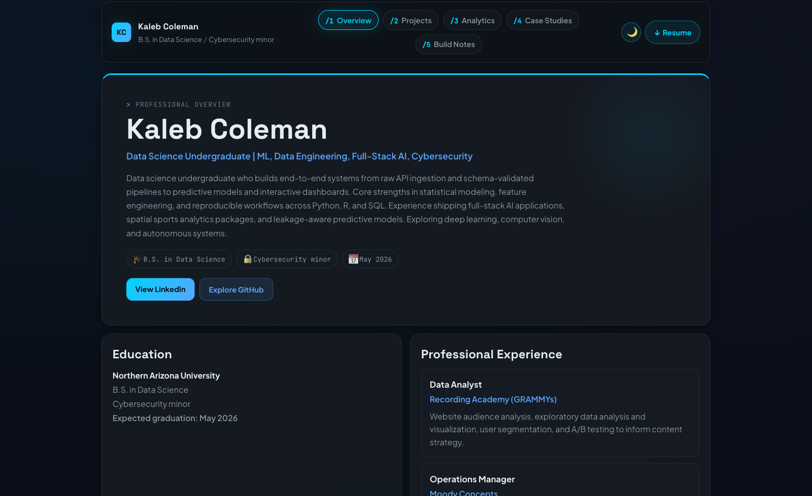
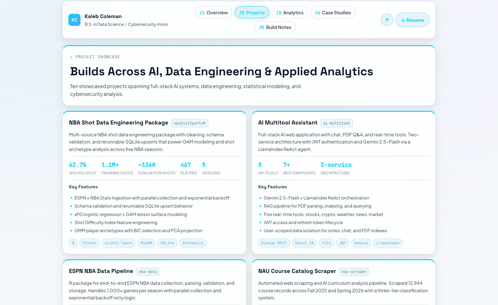
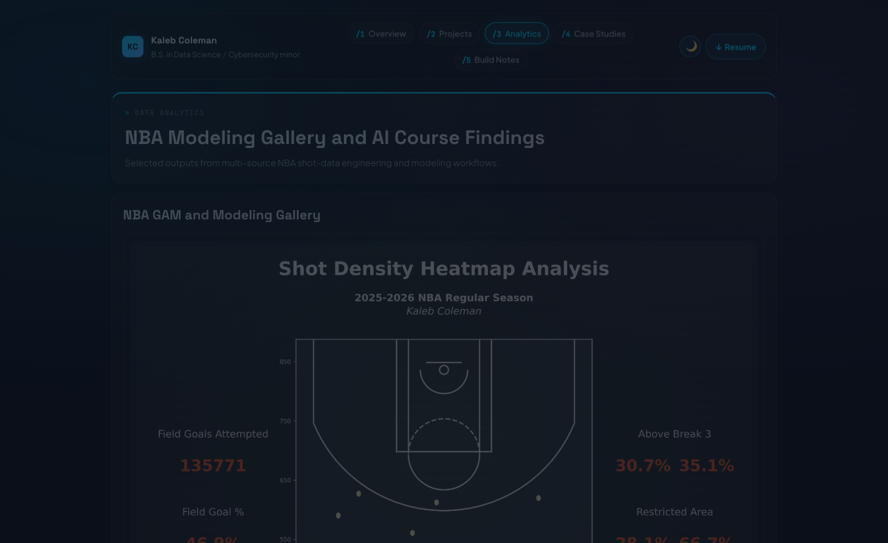
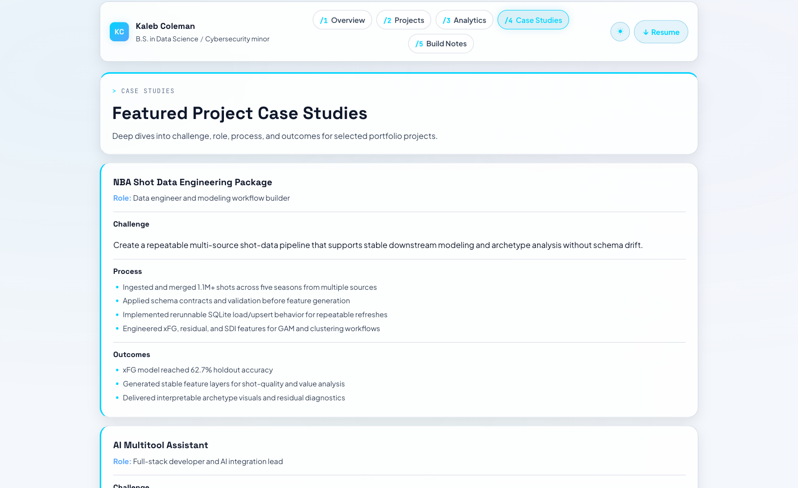
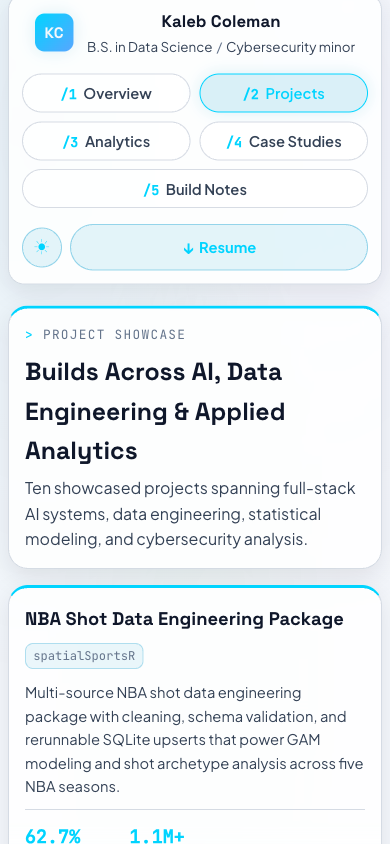

# Kaleb Coleman Portfolio (Flask)

Personal portfolio web app built with Flask, HTML/CSS, and JavaScript.

## Website Preview

### Desktop






### Mobile



## What This App Includes

- Five endpoint pages:
  - `/1` Professional overview
  - `/2` Project showcase
  - `/3` Data analytics gallery + AI course table
  - `/4` Featured case studies (challenge, role, process, outcomes)
  - `/5` Cross-project build notes
- Shared branding, navigation, and responsive layout
- Dummy toolbox API endpoint:
  - `POST /api/toolbox/query`

## Key Current Decisions

- One consistent visual theme across all pages (using the page 1 style system).
- On `/2`, the NAU project card no longer renders the sample course table.
- On `/3`, the top two chart cards were intentionally removed.
- `/3` now displays only two NBA figures in the gallery:
  - `shot_difficulty_vs_actual_efficiency.png`
  - `player_archetypes_scatter.png`
- Gallery image sizing is tuned for full-width fit without overflow.
- `/4` is intentionally distinct from `/2` and uses case-study storytelling instead of summary cards.
- `/5` is intentionally cross-project and summarizes implementation notes for all showcased projects.

## Project Structure

- `app.py`: Flask app, route handlers, and page data
- `templates/`: Jinja page templates
- `static/css/`: shared and page styles
- `static/js/`: optional page scripts
- `static/images/nba_plots/`: NBA analysis figures
- `tests/test_routes.py`: route smoke tests and API contract check

## Run Locally

```bash
pip install -r requirements.txt
export FLASK_APP=app.py
flask run --port 5001
```

Open [http://127.0.0.1:5001/1](http://127.0.0.1:5001/1).

If port `5000` is busy, keep using `--port 5001` (or another open port).

## Test

```bash
python3 tests/test_routes.py
```

## Azure Deployment (GitHub Actions)

This repo includes an App Service deploy workflow at:

- `.github/workflows/azure-webapp-deploy.yml`

It runs tests on push to `master`/`main` and then deploys to Azure Web App.

### One-time setup (your side)

1. Create an **Azure Web App (Linux, Python 3.12)**.
2. In Azure Portal for that Web App, set **Startup Command** to:
   - `gunicorn --bind=0.0.0.0 --timeout 600 app:app`
3. Download the Web App **Publish Profile** from Azure Portal.
4. In GitHub repo settings:
   - Add secret `AZURE_WEBAPP_PUBLISH_PROFILE` with the full publish profile XML.
   - Add repository variable `AZURE_WEBAPP_NAME` with your Azure Web App name.
5. Push to `master` (or run the workflow manually from Actions tab).

After these are set, deployments are automatic on each push.

## Notes on Content Accuracy

- `NAU Course Catalog Scraper` is represented as scraping/cleaning/analysis workflow, not as the SQLite pipeline.
- `NBA Shot Data Engineering Package` is represented as the SQLite + modeling + clustering workflow.
